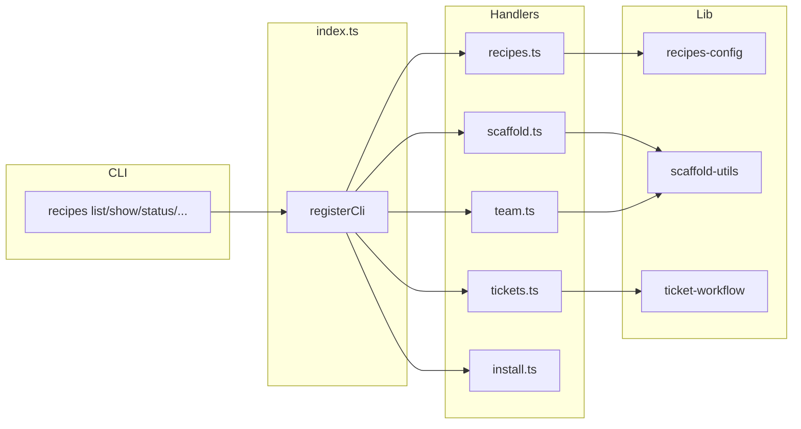

# Architecture

Overview of the ClawRecipes codebase for maintainers.

## Overview

`index.ts` acts as thin CLI wiring: it registers commands via `api.registerCli` and delegates to handlers. Business logic lives in `src/handlers/` and `src/lib/`. The plugin exports `__internal` for test-only access to handlers and lib functions.

## File structure

```
ClawRecipes/
├── index.ts                 # Entry point: CLI wiring, delegates to handlers
├── src/
│   ├── handlers/            # One file per command group
│   │   ├── cron.ts          # Cron reconciliation (used during scaffold)
│   │   ├── install.ts       # install-skill, install (marketplace recipe)
│   │   ├── recipes.ts       # list, show, status, bind, unbind, bindings
│   │   ├── scaffold.ts      # scaffold (single agent)
│   │   ├── team.ts          # scaffold-team, migrate-team, remove-team
│   │   └── tickets.ts       # tickets, move-ticket, assign, take, handoff, dispatch, complete
│   └── lib/                 # Shared logic
│       ├── recipes-config.ts # OpenClaw config load/write, bindings, agent snippets
│       ├── recipes.ts       # Recipe listing, loading, workspace paths
│       ├── recipe-id.ts     # Pick recipe id (auto-increment)
│       ├── scaffold-utils.ts # Shared scaffold logic
│       ├── ticket-workflow.ts # Ticket stages, move, assign, handoff
│       ├── ticket-finder.ts  # Ticket lookup by id/number
│       ├── lanes.ts         # Workflow stages (backlog, in-progress, testing, done)
│       ├── cleanup-workspaces.ts
│       ├── remove-team.ts   # Team uninstall logic
│       └── ...              # prompt, template, skill-install, fs-utils, etc.
├── recipes/                 # Bundled recipe markdown files
├── scripts/                 # Smell-check, scaffold smoke, etc.
└── tests/                   # Vitest unit tests
```

## Handler-to-command map

| Handler   | Commands |
|-----------|----------|
| recipes   | list, show, status, bind, unbind, bindings |
| scaffold  | scaffold |
| team      | scaffold-team, migrate-team, remove-team |
| tickets   | tickets, move-ticket, assign, take, handoff, dispatch, complete |
| install   | install-skill (ClawHub skills), install (marketplace recipe), install-recipe (alias) |
| cron      | Reconciled during scaffold (no standalone command) |

## Shared scaffold flow

Both `scaffold` and `scaffold-team` use:

- `scaffoldAgentFromRecipe` — creates workspace, writes recipe-managed files, applies agent config
- `reconcileRecipeCronJobs` — when a recipe declares `cronJobs`, installs/updates cron jobs per `cronInstallation` config

Cron behavior applies to both commands when the recipe has `cronJobs` in frontmatter.

## Data flow



## Key decisions

- **Tool policy preservation**: When a recipe omits `tools`, the scaffold preserves the existing agent's tool policy (rather than resetting it). See scaffold logic and tests.
- **`__internal` export**: Unit tests import handlers and lib helpers via `__internal`; these are not part of the public plugin API.

## Quality automation

- **smell-check**: `npm run smell-check` runs:
  - **ESLint**: `no-explicit-any`, `complexity`, `max-lines-per-function`, `max-params` (src/; index.ts exempt from complexity/lines)
  - **jscpd**: Duplicate code detection (≥8 lines, ≥50 tokens)
  - **Pattern grep**: `as any` in src/ (max 10), TODO/FIXME/XXX (max 20)
- **lint**: `npm run lint` / `npm run lint:fix`
- **tests**: `npm test` (vitest), `npm run test:coverage`
- **CI**: `.github/workflows/ci.yml` runs test:coverage, smell-check, npm audit

---

If this doc is outdated, please submit a PR to update it.
